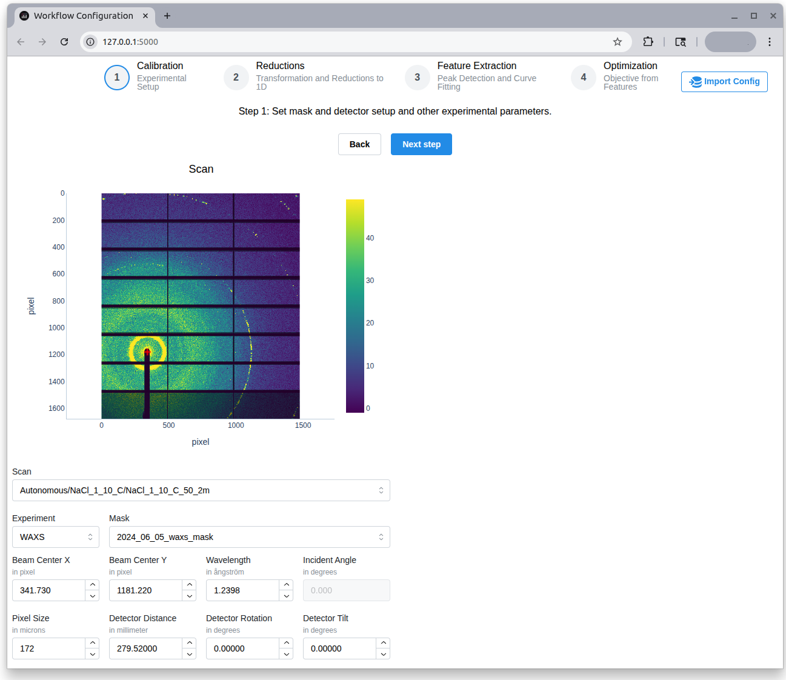

# Workflow Setup Visualization Prototype

A Plotly Dash–based web interface for **interactive configuration and validation** of data-reduction and feature-extraction workflows for SAXS/WAXS experiments.

The interface supports validation of calibration and reduction parameters, inspection of intermediate results, and connectivity checks between infrastructure components **prior to near–real-time processing or autonomous operation**. It does not perform data acquisition or beamline control.

---

## Software architecture

This repository provides a lightweight visualization and configuration layer that sits on top of modular data-processing workflows.

Experimental data and intermediate results are accessed through **Tiled**, while execution is delegated to **Prefect workflows** defined in the companion repository:  
<https://github.com/als-computing/SAXSWAXS-workflows>

Users interactively configure calibration and reduction parameters, trigger workflow execution, and inspect intermediate and final outputs. Validated configurations can be imported/exported and reused for automated or autonomous execution using the same workflows.

Algorithmic details and task-level implementations are intentionally maintained in the workflow repository to keep this interface focused on visualization, validation, and configuration.



---

## Configuration import and export

The **Import Config** button on the top right allows direct input of a JSON specification containing validated calibration parameters, enabling reuse across runs and transfer to automated execution contexts.

Example:

```json
{
  "beamcenter_x": 341.73,
  "beamcenter_y": 1181.22,
  "wavelength": 1.2398,
  "sample_detector_dist": 279.52,
  "pix_size": 172,
  "rotation": 0,
  "tilt": 0
}
```

---

## Initial setup: Clone the repository, create an environment, activate the environment, with venv

Clone the repository:

```bash
git clone git@github.com:als-computing/workflow-viz.git
cd workflow-viz
```

Setup an environment, for example with venv:

```bash
python3 -m venv workflow-viz-env
source workflow-viz-env/bin/activate
```

or Anaconda:

```bash
conda create --name workflow-viz-env python=3.9 
conda activate workflow-viz-env
```

and install the requirements:

```bash
pip install -r requirements.txt
```

## Initial + beamtime setup: Set correct paths

Copy `.env.example` to `.env`, then update the values:

```bash
cp .env.example .env
```

Either `PATH_TO_RAW_DATA` and `PATH_TO_PROCESSED_DATA` may be contained in the same directory. They must match with the corresponding variables in the `SAXSWAXS-workflows` environment: <https://github.com/als-computing/SAXSWAXS-workflows>.
Additionally, the `TILED_API_KEY` needs to be the same.

If `TILED_WHITELIST` is empty, no files/directories will be skipped, but if it is not one needs to specify all names to be whitelisted (including top-level directory names, e.g. `"raw, processed, <beamtimeid>"`).

All entries in `TILED_BLACKLIST` cause any directory or file containing a substring of the listed entries to be skipped.

## Beamtime setup: Start up a Tiled

Within two separate processes, start the Tiled server

```bash
tiled/tiled_config_serve.sh
```

and register the already existing files to Tiled

```bash
tiled/tiled_catalog_register.sh
```

## Beamtime Setup: Start up a Prefect with Reduction Flows

Follow the setup instructions in `SAXSWAXS_workflows`(<https://github.com/als-computing/SAXSWAXS-workflows>) to:

- Start a Prefect server
- Deploy/register the SAXS/WAXS reduction flows
- Start a Prefect worker

## Beamtime setup: Start up the Dash application

```bash
python app.py
```

If data in Tiled is available and Prefect is configured correctly, data can be selected an reduced according to the experiment type.

The current default reduction type is azimuthal integration for transmission experiments (small-angle-scattering (SAXS)) and (wide-angle-scattering (WAXS)), and a line-cut for grazing-incidence.

# Copyright

MLExchange Copyright (c) 2023, The Regents of the University of California, through Lawrence Berkeley National Laboratory (subject to receipt of any required approvals from the U.S. Dept. of Energy). All rights reserved.

If you have questions about your rights to use or distribute this software, please contact Berkeley Lab's Intellectual Property Office at <IPO@lbl.gov>.

NOTICE.  This Software was developed under funding from the U.S. Department of Energy and the U.S. Government consequently retains certain rights.  As such, the U.S. Government has been granted for itself and others acting on its behalf a paid-up, nonexclusive, irrevocable, worldwide license in the Software to reproduce, distribute copies to the public, prepare derivative works, and perform publicly and display publicly, and to permit others to do so.
